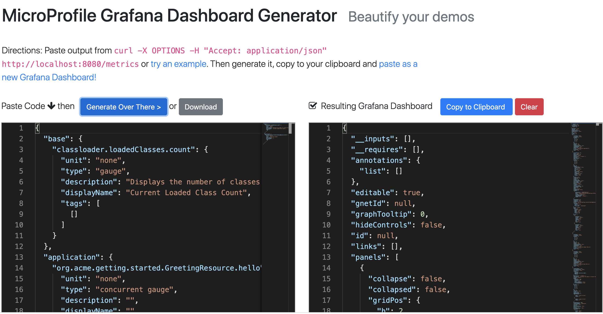
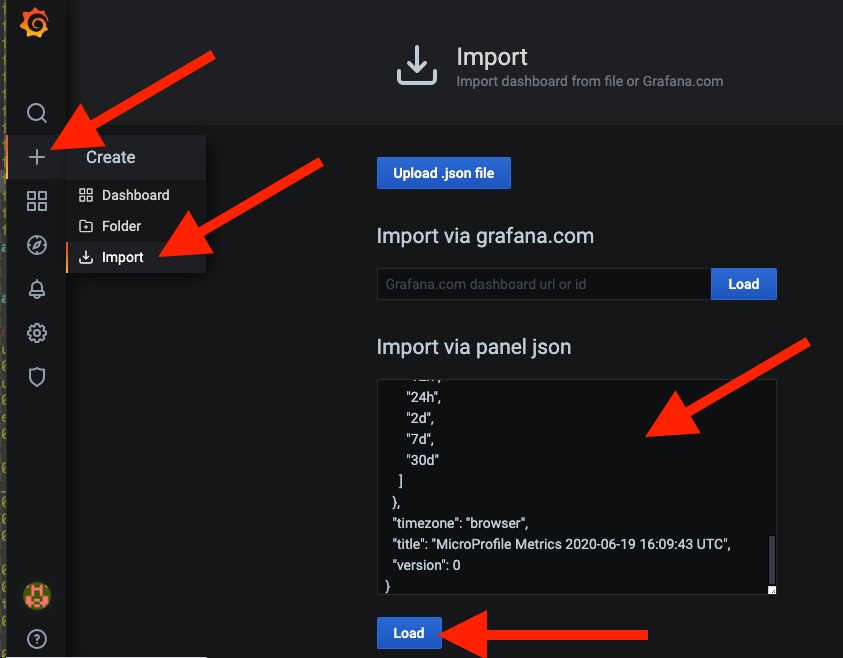
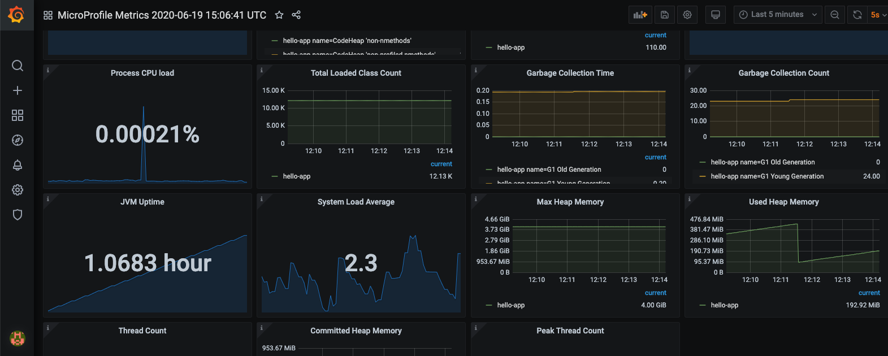

## MicroProfile Metrics Generator

This project presents a web frontend to generate Grafana dashboards that show metrics from
a MicroProfile application.

## Prereqs

To run this locally, you'll need to install [jsonnet]() and [grafonnet]().

You'll also need `git`, `npm`, `node`, `curl`, etc. To run grafana and prometheus locally you'll need `docker`.

First, clone this repo with `git clone` to your local desktop and move into the top-level directory of the cloned repo.

Then:

## Linux: Install jsonnet and grafonnet

```sh
curl -L -o jsonnet.tar.gz https://github.com/google/jsonnet/releases/download/v0.16.0/jsonnet-bin-v0.16.0-linux.tar.gz
tar -xvzf jsonnet.tar.gz
git clone https://github.com/grafana/grafonnet-lib.git
```

## Mac: Install jsonnet and grafonnet

```sh
brew install jsonnet
git clone https://github.com/grafana/grafonnet-lib.git
```

If you don't use HomeBrew then check out [these install instructions](https://github.com/google/jsonnet#packages) to get the `brew` command.

## Ensure microprofile app is running

Prometheus will look for metrics at `http://localhost:8080/metrics` so be sure it's running!

## Run prometheus and grafana via `docker`

If you already have a [Prometheus](https://prometheus.io/) and [Grafana](https://grafana.com/) instance up and running and hooked together, you'll need to configure Prometheus to scrape metrics from your app. Check out the [Prometheus configuration docs](https://prometheus.io/docs/prometheus/latest/configuration/configuration/) on how to do it.

To run using the pre-defined jobs in this repo, first it is assumed the MicroProfile app you wish to visualize is running on your local machine at `localhost:8080` and exposes its metrics at `localhost:8080/metrics`. You can edit `prometheus/prometheus.yml` in this repo if you need to change how prometheus finds your app.

Next, in a separate terminal, run Prometheus with `cd prometheus; ./runlocal.sh`. This starts prometheus using `docker` and configures it to look for your app at the special hostname `host.docker.internal` which refers to your local desktop host.

Access prometheus at `http://localhost:9090` and confirm you can access your app's metrics using the query browser.

Next, in another separate terminal, run Grafana locally with the `cd grafana; ./runlocal.sh`, which has been pre-configured for the prometheus you just invoked.

Check Grafana is working at `http://localhost:3000`. Login with the default credentials `admin/admin`.

## Running the app

First, set the following environment variables to tell the app where things are:

```sh
export JSONNET_BIN=$(which jsonnet) # set to the path of the jsonnet binary
export JSONNET_LIB=$(pwd)/grafonnet-lib # or wherever you cloned it to
export JSONNET_FILE=$(pwd)/dashboards/microprofile.jsonnet # the jsonnet processor for microprofile metrics
export PORT=8081 # or a different port if 8081 is taken
```

Run the generator app from the base directory of this repo with:

```
npm install
npm start
```

Then visit `http://localhost:8081` and follow the instructions to generate a dashboard, and copy it to your clipboard.



Then, in Grafana, add a new Dashboard with the `+` button and choose `Import`, and paste the JSON dashboard into the field and click **Load**.



And enjoy your new metrics:



At this point you can edit the dashboard until you are happy with it, save it, check it into source control, or throw it away and start again!

